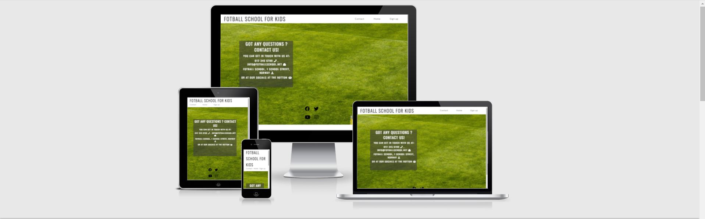
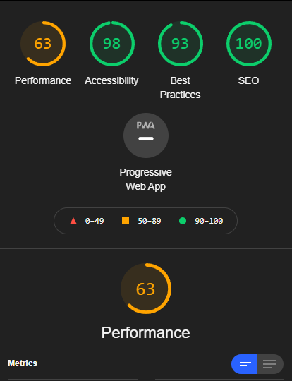
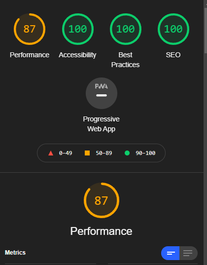
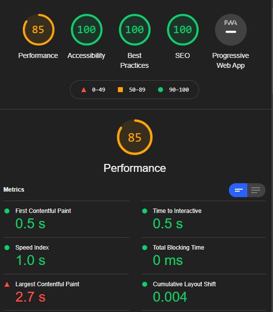

 # Fotball School For Kids 

The fotball school for kids website is a landing page for parents and children looking to advance their fotball skills. It ranges from age 6 to 14. 
The school offers alot of fun and individual training per kid from a young age. 

The users of this website will be able to find all the information they need to know about the Footbal School. About the school, training times and day, contact information and sign up form. 
This site is targeted towards the parents of children who wants to further develop their fotball skills. 

## Features

* Navigation
- Featured at the top of the page, the navigation shows the school name in the top left corner: "Football School for Kids" that also links you to the top of the page
- The other navigation links are to the top right: Contact, Home and Sign Up. Which links to new pages. 
- The navigation makes it easy to find where to sign up and where to find contact information. 

## The Header

- The header explain what it is and why you should choose their fotball school. And it is for kids.
- This section provides with info about the teachers and their history.

## The About Us Section

- The about us section gives us a table with the schools meeting times.
- Also links to their socials 

## The Sign Up Page

- The sign up section has a form to collect details from parents so they can sign up to the Fotball School for Kids
- The form collects the parents first and last name, childs name and parents email. 
- You also choose what day to sign up for.

## Contact Us Page

- The contact section encourages users to get in touch with the school if they have any questions.
- Here you can find: Phone number, Email, Street address and also includes our social icons.
- The contact section is very valuable as they can easly get in touch if they have any questions.

## Testing

- Tested the pages in following browsers: Chrome, Edge and Firefox
- Confirmed the project is responsive to other displays, looks good and functions good on different screen sizes using the devtools device toolbar
- Tested mostly on Ipad, iphonexr and iphone4 and laptop and desktop. 

## Bugs

### Solved bugs

- Had issues with icons not appearing where I`d like them to be
- Main picture on home-page didnt work when deploying the site
- Bugs with icons appearing strange places on mobile devices and some laptop sizes.

## Validator Testing

* HTML
- No errors on HTML test using W3C Validator

* CSS
- No errors on CSS test using W3C CSS Validator

* Accessibility
- Confirmed that the colors and fonts chosen are easy to read and accessible by running it through the lighthouse devtools.

- Lighthouse Home page:

- Lighthouse Contact page:

- Lighthouse Sign-up page:

- Pictures seems to be big in size that might cause the performance to take a hit. 

## Unfixed Bugs
- No unfixed bugs 

## Deployment

-  The site was deployed to GitHub pages. The steps to delpy are as follows:
    - Choose the repository you'd like to deploy on the frontpage.
    - Choose "Settings" on the top bar.
    - Find "Pages" on the side bar.
    - Under "Source" choose "main" branch and save. After about 3-5mins your site should be deployed.

    * Live link can be found here - [Project-1 - Stian](https://sajalol.github.io/Project1/index.html)

## Credits

 ### Content
 - The code to make social links were taken from the Love Running project. 
 - Used some of the styling from Sign-up form in love running project.

 ### Media
- All of the pictures were taken from [Pexel](https://www.pexels.com/nb-no/)

