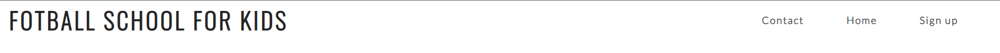
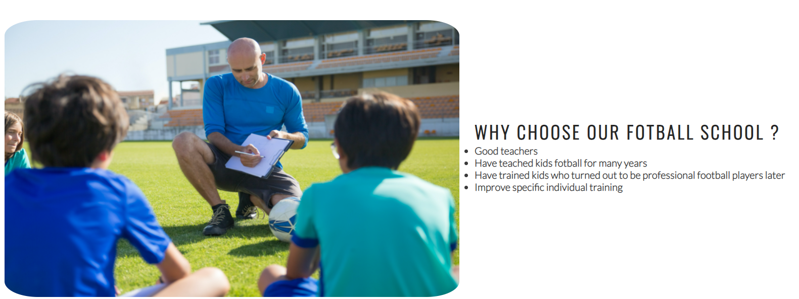
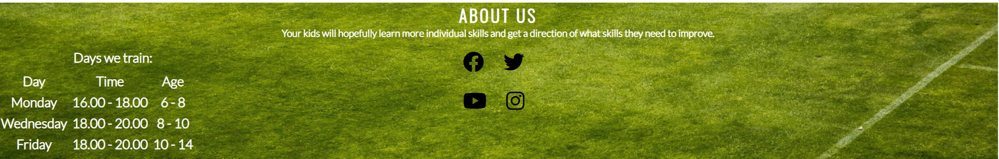

 # Fotball School For Kids 

The fotball school for kids website is a landing page for parents and children looking to advance their fotball skills. It ranges from age 6 to 14. 
The school offers alot of fun and individual training per kid from a young age. 

The users of this website will be able to find all the information they need to know about the Footbal School. About the school, training times and day, contact information and sign up form. 
This site is targeted towards the parents of children who wants to further develop their fotball skills. 

/* Screenshots from am http://ami.responsivedesign.is/ */

##Features

* Navigation
- Featured at the top of the page, the navigation shows the school name in the top left corner: "Football School for Kids" that also links you to the top of the page
- The other navigation links are to the top right: Contact, Home and Sign Up. Which links to new pages. 
- The navigation makes it easy to find where to sign up and where to find contact information. 

## The Header

- The header explain what it is and why you should choose their fotball school. And it is for kids.
- This section provides with info about what they can and some details about them.

## The About Us Section

- The about us section gives us a table with the schools meeting times.
- Also links to their socials 

## The Sign Up Page

- The sign up section has a form to collect details from parents so they can sign up to the Fotball School for Kids
- The form collects the parents first, last name and email. 
- You also choose what day to sign up for.

## Contact Us Page

- The contact section encourages users to get in touch with the school if they have any questions
- Here you can find: Phone number, Email, Street address. Also our socials

